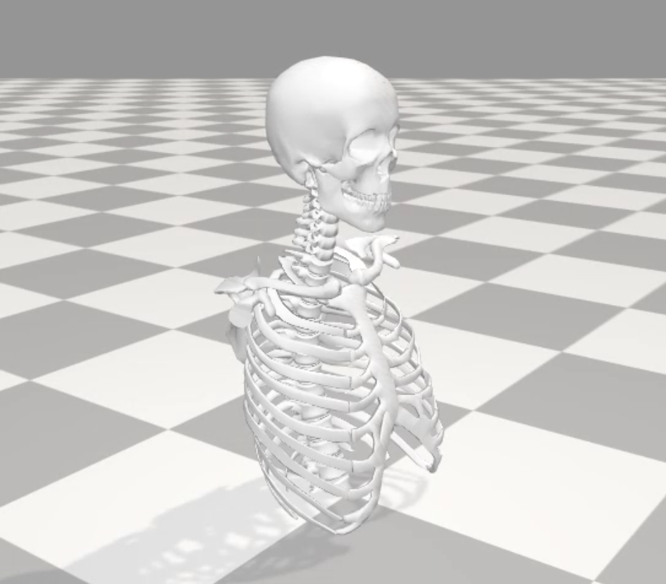

# IMU-Based Cervical Spine Motion Analysis

This repository provides a complete workflow for acquiring, processing, and analyzing cervical spine motion using a dual IMU setup. It enables translation of raw sensor data into biomechanical simulations using OpenSim and AnyBody Modeling System.

---

## Prerequisites

Before using this repository, ensure you have the following:

- Python (Conda recommended)  
- MATLAB (for ROM computation and data conversion)  
- OpenSim 4.5 installed  
- AnyBody Modeling System (AMS)  
- Movella DOT PC SDK (for sensor interfacing)  
- Bluetooth-enabled system (for IMU communication)  

---

## Features

- Dual IMU data acquisition using Xsens DOT sensors  
- Structured preprocessing pipeline for motion data  
- Orientation and ROM extraction workflows  
- Integration with OpenSim for kinematic simulation  
- Integration with AnyBody for musculoskeletal modeling  
- Support for both single-subject and batch processing  

---

## Architecture

The system follows a modular pipeline from sensor acquisition to biomechanical simulation:
```bash

┌──────────────────────────────┐
│   Data Acquisition           │
│   (Python - py310 env)       │
└──────────────┬───────────────┘
               │
               ▼
┌──────────────────────────────┐
│        Raw IMU Data          │
└──────────────┬───────────────┘
               │
               ▼
┌──────────────────────────────┐
│     Preprocessing (Python)   │
└──────────────┬───────────────┘
               │
     ┌─────────┴─────────┐
     │                   │
     ▼                   ▼
┌──────────────┐   ┌──────────────────┐
│ MATLAB ROM   │   │ Orientation Data │
│ Computation  │   │ (Processed IMU)  │
└──────┬───────┘   └────────┬─────────┘
       │                    │
       ▼                    ▼
┌──────────────┐   ┌──────────────────┐
│ AnyBody      │   │ OpenSim          │
│ Modeling     │   │ Simulation       │
└──────────────┘   └──────────────────┘

```


---

## Sensor Description

This project uses Xsens DOT IMU sensors for capturing cervical spine motion.

### Sensor Placement


- **Sensor 1**: Mounted on the occipital bone (head movement reference)  
- **Sensor 2**: Mounted on the C7 vertebra (base reference)  

This configuration allows relative motion analysis of the cervical spine, enabling accurate estimation of flexion/extension and other sagittal plane movements.


## Data preprocessing Installation and Setup

To ensure all dependencies (including the Movella DOT PC SDK and system libraries like **openssl** and **zlib**) are installed correctly, use the provided `environment.yml` file.

### 1. Create the Environment
Open your terminal or Anaconda Prompt, navigate to this project folder, and run:

```bash
conda env create -f environment.yml
```

### 2. Activate the Environment
Once the installation is complete, activate the environment to load the dependencies:

```bash
conda activate
```

---

## Data Acquisition

After activating the environment, you can run the example scripts to interface with your sensors.

### Run the Export Script
To collect and export data from a dual IMU setup, use:

```bash
python dual_imu_export.py
```

> **Note:** Ensure your Movella DOT sensors are powered on and within range of your Bluetooth adapter.


# Opensim Setup and Simulation 

## Prerequisites

### 1. OpenSim Installation
*   Download **OpenSim 4.5** from [SimTK](https://simtk.org/frs/?group_id=91).
*   Follow the installation instructions and install to the **default location**.

### 2. File Placement
*   Place the `Opensense` folder in the following directory:
    `C:\Users\<YourUsername>\Documents\OpenSim\4.5\Code\Matlab`

---

## Preprocessing Setup

To ensure the processing scripts run correctly, create the Conda environment using the provided `.yml` file:

```bash
# Create the environment
conda env create -f environment.yml

# Activate the environment
conda activate preprocessing_env

```

Data Processing

    Single Subject: Use Preprocessing.py to process data for one subject.

    Multiple Subjects: Use batch_preprocessing.py to process data for multiple subjects at once.

Post-Preprocessing

    Locate the two processed .txt files generated by the scripts.

    Place these files in the following directory:
    Opensim\Opensense\IMUData

# Cervical Spine Routine (Opensim)

## Inverse Kinematics (IK)

Run the IK as instructed in the OpenSim Documentation [here](https://opensimconfluence.atlassian.net/wiki/spaces/OpenSim/pages/53084203/OpenSense+-+Kinematics+with+IMU+Data), using the provided MATLAB script.

## Simulation:

## OpenSim Simulation

[](Assets/opensim_simulation.mp4)


## AnyBody Modeling System (AMS) Integration

This section details the workflow for performing kinetic analysis and musculoskeletal modeling using the AnyBody Modeling System (AMS).

### 1. File Placement
Place the **C7 Occipital Markers** folder in the following directory to ensure the scripts can locate the necessary marker data:
`C:\Users\[YourUsername]\Documents`

---

### 2. Data Conversion
To translate the processed IMU data into a format compatible with AnyBody scripts (`.any`), use the provided MATLAB routines:

*   **Single Subject:** Run `Xsens_raw_to_anybody.m`
*   **Multiple Subjects:** Run `Batch_Xsens_raw_to_anybody.m`

---

### 3. Model Loading & Execution
Once the data is converted, proceed with the musculoskeletal simulation in AMS:

1.  **Load the Model:** Open AnyBody Modeling System and load the main model file found in the `Model` folder.
2.  **Define Drivers:** Ensure the scripts are pointing to the converted data from the previous step to drive the cervical spine segments.
3.  **Run Inverse Kinematics (IK):** Execute the **IK operation** in the Operations tree to synchronize the musculoskeletal model with your IMU-derived motion data.